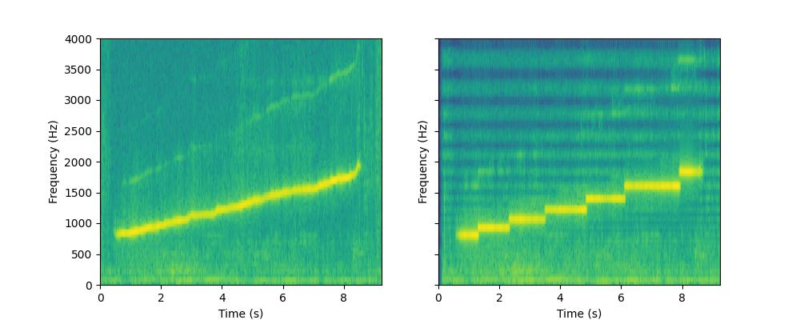
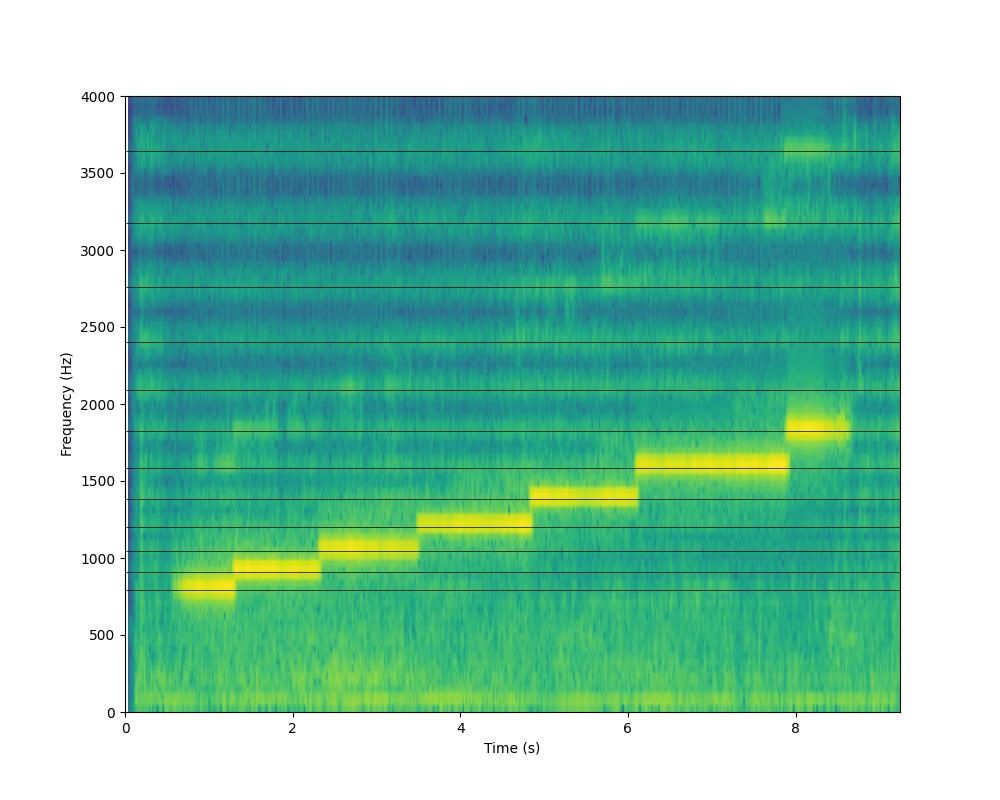

Xentotune
=========
A microtonal autotuner plugin.

Uses the [Signalsmith Stretch](https://github.com/Signalsmith-Audio/signalsmith-stretch)
library to do the pitch shifting and [MTS-ESP](https://github.com/ODDSound/MTS-ESP)
to pull the tuning.

Built plugins are available for Mac, Windows, and Linux on the github
[releases page](https://github.com/narenratan/xentotune/releases).

What it does
------------
This plugin maps each frequency in the input onto the nearest frequency in the
MTS-ESP tuning.

For example, I recorded myself whistling a continuously increasing pitch, then
retuned the recording into 5EDO (five equal divisions of the octave). Here are
the spectrograms of the unprocessed audio (left) and the output of the plugin
(right):



The continuous increase in pitch in the original audio is converted into a
quantized 'staircase' on the pitches of 5EDO.

Here's the spectrogram of the processed audio with the 5EDO frequencies added
as black lines:



Note that all frequencies, the fundamental and higher partials alike, are
mapped onto the 5EDO frequencies. This allows the autotuning to work on
polyphonic input. It also means the timbre of the output will in general be
inharmonic, since the higher partials may not be at multiples of the
fundamental frequency.

How to use
----------
- Add the Xentotune plugin to the track to be retuned.
- Use an MTS-ESP source like [MTS-ESP Mini](https://oddsound.com/mtsespmini.php),
  [Surge XT](https://surge-synthesizer.github.io), or [Wilsonic](https://wilsonic.co)
  to set the tuning.

Build
-----
To build from source:

```console
    $ git clone --recurse-submodules https://github.com/narenratan/xentotune
    $ cd xentotune
    $ cmake -B build -DCMAKE_BUILD_TYPE=Release
    $ cmake --build build --config Release
```
